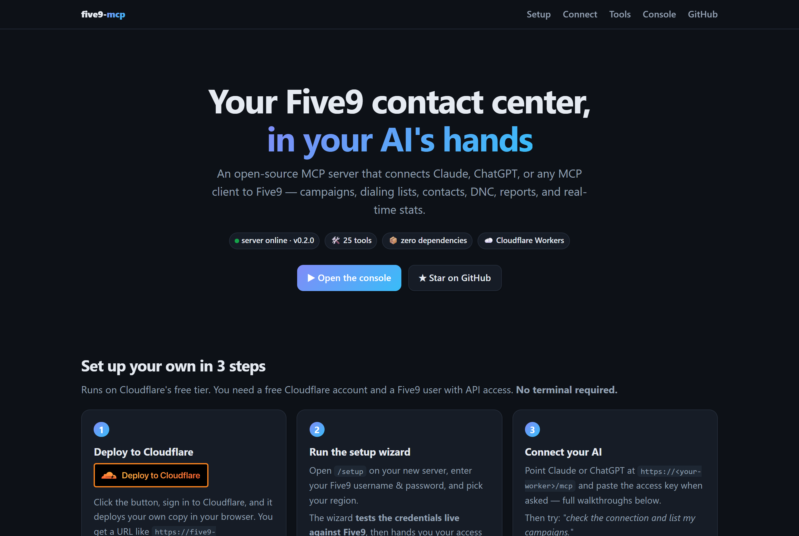
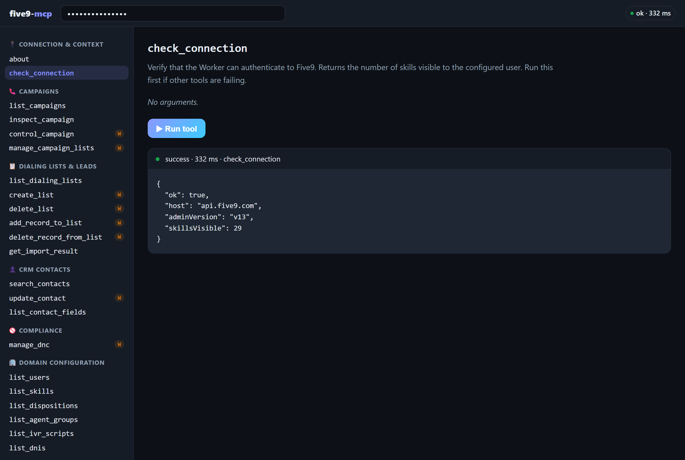
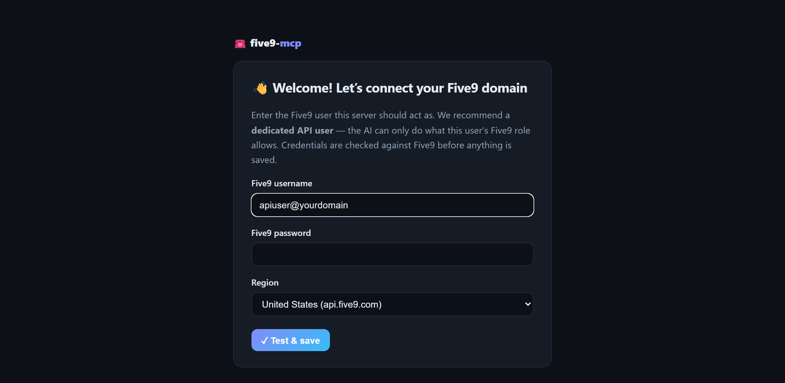

<div align="center">

# ☎️ five9-mcp

**Your Five9 contact center, in your AI's hands.**

An open-source [MCP](https://modelcontextprotocol.io) server that connects Claude, ChatGPT, or any MCP client to the **Five9** cloud contact center — running on **Cloudflare Workers** with **zero dependencies**.

[](LICENSE)
[](https://workers.cloudflare.com)
[](package.json)
[](https://modelcontextprotocol.io)
[](#-the-toolbox-25-tools)

[Quick start](#-quick-start--no-terminal-needed) · [Connect Claude](#connect-claude-web--desktop) · [Connect ChatGPT](#connect-chatgpt) · [Tools](#-the-toolbox-25-tools) · [Architecture](#%EF%B8%8F-architecture)



</div>

---

Ask your AI things like:

> *"Who's on a call right now, and how deep is the sales queue?"* 📊
> *"Stop the OUTBOUND_AGED campaign and add these 3 leads to the callback list."* 📞
> *"Is 555-867-5309 on our DNC? Check before anyone dials it."* 🚫
> *"Pull yesterday's Call Log report and summarize abandon rates."* 📈

Under the hood, this server speaks Five9's Configuration (admin) and Statistics (supervisor) **SOAP Web Services** — the APIs that still run Five9's admin surface — and exposes them as clean JSON tools over MCP streamable HTTP. Hand-rolled envelopes, a ~60-line XML parser, no npm packages. Every tool has been exercised against a live Five9 domain.

## ✨ Built-in web UI

Deploy it and your Worker serves more than an API:

| Page | What you get |
|------|--------------|
| `/` | A polished landing page: live server status, this setup guide, click-by-click AI connection walkthroughs, and the full tool catalog |
| `/setup` | The **setup wizard** — enter Five9 credentials in your browser, get them verified live, receive your access key. No terminal, no secrets commands |
| `/console` | An **interactive console** — paste your access key, pick any of the 25 tools, fill a generated form, and run it against your live Five9 domain right from the browser |
| `/mcp` | The MCP endpoint itself (streamable HTTP, stateless) |
| `/health` | JSON healthcheck |

The console is the fastest way to sanity-check credentials, explore what each tool returns, or debug a campaign — no AI required.

<div align="center">

<br><em>The console running <code>check_connection</code> against a live Five9 domain</em>
</div>

## 🚀 Quick start — no terminal needed

You need a free Cloudflare account and a Five9 user with API access — **create a dedicated Five9 API user** scoped to what you want an AI to do, don't reuse a personal admin login.

**1 — Deploy to Cloudflare** *(one click, in your browser)*

[](https://deploy.workers.cloudflare.com/?url=https://github.com/ryanshatz/five9-mcp)

Sign in to Cloudflare and click through — it creates your own copy of this Worker (plus the KV namespace it needs) and gives you a URL like `https://five9-mcp.you.workers.dev`.

**2 — Run the setup wizard** *(in your browser)*

Open **`/setup`** on your new server. Enter your Five9 username, password, and region — the wizard **verifies them live against Five9** before saving, then hands you your **access key** (shown once — store it in a password manager).

<div align="center">

</div>

**3 — Connect your AI** (walkthroughs below), then ask it to *"check the connection and list my campaigns."* 🎉

<details>
<summary><strong>⌨️ Prefer the CLI?</strong></summary>

```sh
git clone https://github.com/ryanshatz/five9-mcp
cd five9-mcp
npx wrangler kv namespace create CONFIG   # paste the printed id into wrangler.toml
npx wrangler deploy
```

Then either use the `/setup` wizard, or skip it and manage credentials as Wrangler secrets (secrets override the wizard):

```sh
npx wrangler secret put FIVE9_USERNAME   # e.g. apiuser@yourdomain
npx wrangler secret put FIVE9_PASSWORD
npx wrangler secret put MCP_AUTH_TOKEN   # a long random string — this is the key to your server
```

</details>

<details>
<summary><strong>🌍 Non-US domain or different API version?</strong></summary>

Defaults live in `wrangler.toml` and work for US domains:

| Var | Default | Notes |
|-----|---------|-------|
| `FIVE9_API_HOST` | `api.five9.com` | EU: `api.eu.five9.com` · Canada: `api.ca.five9.com` |
| `FIVE9_ADMIN_VERSION` | `v13` | Config Web Services WSDL version |
| `FIVE9_SUPERVISOR_VERSION` | `v13` | Statistics Web Services WSDL version |

</details>

## 🔌 Connect your AI

### Connect Claude (web & desktop)

Custom connectors are available on Free (one connector), Pro, Max, Team, and Enterprise plans.

1. In [claude.ai](https://claude.ai) or the Claude desktop app, open **Settings → Connectors**.
2. Click **Add custom connector**.
3. Name it **Five9** and paste your server URL **including the `/mcp` path**:
   `https://<your-worker>.workers.dev/mcp`
4. Click **Add**, then **Connect**. Claude auto-discovers this server's built-in OAuth and opens its authorization page.
5. On the **🔐 five9-mcp** screen, paste your `MCP_AUTH_TOKEN` as the access key and click **Authorize**.
6. In any chat, open the **search & tools** (＋) menu and make sure the Five9 connector is toggled on.

> **Team/Enterprise:** an Owner first adds the connector under **Organization settings → Connectors**; members then click **Connect** in their own settings to authorize.

### Connect ChatGPT

Custom MCP connectors require **Developer mode** (Plus/Pro; on Business/Enterprise an admin must allow custom connectors).

1. In [ChatGPT](https://chatgpt.com) on the web, open **Settings → Apps & Connectors** (sometimes labeled just **Connectors**).
2. Under **Advanced settings**, toggle **Developer mode** on.
3. Back on the Connectors page, click **Create**.
4. Name it **Five9**, set the **MCP server URL** to `https://<your-worker>.workers.dev/mcp`, and choose **OAuth** authentication.
5. Acknowledge the trust prompt and save. ChatGPT opens this server's authorization page — paste your `MCP_AUTH_TOKEN` and click **Authorize**.
6. In a new chat, open the ＋ / tools menu and enable the **Five9** connector (Developer mode connectors are enabled per-conversation). ChatGPT asks you to confirm each tool call — sensible for anything that can start a dialer. 😄

### Connect Claude Code

```sh
claude mcp add --transport http five9 https://<your-worker>.workers.dev/mcp \
  --header "Authorization: Bearer <your MCP_AUTH_TOKEN>"
```

The raw access key works directly as a bearer token — no OAuth dance. Run `/mcp` inside Claude Code to verify.

### Any other MCP client

Anything that speaks MCP **streamable HTTP** works — complete the OAuth flow or send the access key as a bearer token:

```sh
curl -X POST https://<your-worker>.workers.dev/mcp \
  -H "Authorization: Bearer <MCP_AUTH_TOKEN>" \
  -H "Content-Type: application/json" \
  -d '{"jsonrpc":"2.0","id":1,"method":"tools/call","params":{"name":"check_connection","arguments":{}}}'
```

<details>
<summary><strong>🔐 How the built-in OAuth works</strong></summary>

`src/oauth.js` implements a minimal OAuth 2.1 authorization server (metadata discovery, dynamic client registration, PKCE S256, refresh tokens) designed for a **single-operator** deployment:

- The "login" on the consent screen is the server's access key (`MCP_AUTH_TOKEN`).
- Everything is stateless — client IDs, auth codes, and tokens are HMAC-SHA256-signed blobs keyed by `MCP_AUTH_TOKEN`. No KV, no Durable Objects.
- Both auth paths work simultaneously: OAuth-minted tokens *and* the raw key as a bearer credential.
- Revoke everything at once by rotating the secret: `npx wrangler secret put MCP_AUTH_TOKEN`.

</details>

## 🧰 The toolbox (25 tools)

🟢 = read (always safe) · ✏️ = write (changes your domain — the server tells AIs to confirm with you first)

<details open>
<summary><strong>🔌 Connection & context</strong></summary>

| | Tool | What it does |
|--|------|--------------|
| 🟢 | `about` | Operator context for the AI — who runs this server and the ground rules |
| 🟢 | `check_connection` | Verify Five9 credentials work; returns visible skill count |

</details>

<details open>
<summary><strong>📞 Campaigns</strong></summary>

| | Tool | What it does |
|--|------|--------------|
| 🟢 | `list_campaigns` | List campaigns (name, type, state, mode), optional name regex |
| 🟢 | `inspect_campaign` | One call: state + attached lists (outbound) + DNIS (inbound) |
| ✏️ | `control_campaign` | Start / stop / reset a campaign |
| ✏️ | `manage_campaign_lists` | Attach or detach a dialing list, with dialing priority |

</details>

<details open>
<summary><strong>📋 Dialing lists & leads</strong></summary>

| | Tool | What it does |
|--|------|--------------|
| 🟢 | `list_dialing_lists` | List outbound dialing lists + record counts |
| ✏️ | `create_list` | Create a new empty dialing list |
| ✏️ | `delete_list` | Delete a dialing list (CRM contacts untouched) |
| ✏️ | `add_record_to_list` | Push a lead into a dialing list (async Five9 import) |
| ✏️ | `delete_record_from_list` | Remove matching records from a list (CRM contacts untouched) |
| 🟢 | `get_import_result` | Check the outcome of an async list/CRM import |

</details>

<details open>
<summary><strong>👤 CRM contacts</strong></summary>

| | Tool | What it does |
|--|------|--------------|
| 🟢 | `search_contacts` | Look up contact records by exact field values |
| ✏️ | `update_contact` | Update an existing contact; defaults to sole-match safety |
| 🟢 | `list_contact_fields` | Discover the domain's contact field schema |

</details>

<details open>
<summary><strong>🚫 Compliance</strong></summary>

| | Tool | What it does |
|--|------|--------------|
| ✏️ | `manage_dnc` | Check / add / remove numbers on the domain Do-Not-Call list |

</details>

<details open>
<summary><strong>🏢 Domain configuration</strong></summary>

| | Tool | What it does |
|--|------|--------------|
| 🟢 | `list_users` | List agents / supervisors / admins |
| 🟢 | `list_skills` | List skills (routing queues) |
| 🟢 | `list_dispositions` | List call dispositions and their settings |
| 🟢 | `list_agent_groups` | List agent groups and their members |
| 🟢 | `list_ivr_scripts` | List IVR scripts (metadata only) |
| 🟢 | `list_dnis` | List provisioned inbound numbers; optionally only unassigned |

</details>

<details open>
<summary><strong>📈 Reporting & real-time</strong></summary>

| | Tool | What it does |
|--|------|--------------|
| 🟢 | `run_report` | Kick off any report by folder + name, optional time range |
| 🟢 | `get_report_result` | Poll for the report's CSV output |
| 🟢 | `get_realtime_stats` | `AgentState`, `ACDStatus`, `CampaignState`, `Inbound/OutboundCampaignStatistics`, `AgentStatistics` |

</details>

## 🎨 Customizing the operator context

`src/about.js` holds the text served to connected AIs via the MCP `instructions` field and the `about` tool: who operates the server, why it exists, and how the AI should behave (e.g. *"confirm before write actions"*). **Edit it to describe your own deployment** — it ships with the original operator's context as an example.

## 🏗️ Architecture

No build step, no dependencies — plain JS modules in `src/`:

```
src/
├── index.js   # router, CORS, MCP JSON-RPC handler, /setup endpoint
├── five9.js   # SOAP client: envelope builder, ~60-line XML parser, one method per Five9 op
├── tools.js   # MCP tool definitions (JSON Schema) + dispatch
├── oauth.js   # stateless OAuth 2.1 server (single-operator model)
├── config.js  # config resolution: Wrangler secrets > KV (setup wizard)
├── ui.js      # landing page, setup wizard, interactive console
└── about.js   # operator context — edit this for your deployment
```

Requests are stateless: every MCP call opens a fresh Five9 SOAP exchange with HTTP Basic auth. The Statistics API additionally requires a `setSessionParameters` call, which `get_realtime_stats` performs per invocation.

<details>
<summary><strong>⚔️ Notes on Five9's SOAP API (learned the hard way)</strong></summary>

- Five9's endpoints are generated by JAXB and **validate child-element order** against the WSDL sequence. If you extend this server, pull the WSDL (`https://api.five9.com/wsadmin/v13/AdminWebService?wsdl`, HTTP Basic auth) and match the `<xs:sequence>` order exactly — including base types like `basicImportSettings`, whose elements come *before* the extension's.
- `addToListCsv` requires `cleanListBeforeUpdate`, `crmAddMode`, `crmUpdateMode`, and `listAddMode` even though the WSDL marks most of them `minOccurs="0"`.
- List/CRM imports are **asynchronous**: the call returns an import identifier immediately; poll `get_import_result` for the outcome.
- Contact record values come back wrapped (`<values><data>…</data></values>`); several responses return a single object where you'd expect a one-element array. `toArray()` in `five9.js` normalizes this.
- Report time criteria order is `<end>` **before** `<start>` (JAXB alphabetical ordering).

</details>

## 🛡️ Security

- Five9 credentials live in your Cloudflare account only — as Worker secrets, or (wizard path) in a Workers KV namespace, encrypted at rest. No tool ever returns them, and Wrangler secrets always override KV.
- The setup wizard is **open only on a fresh, unconfigured server** — run it right after deploying. Once configured, any change requires the current access key, and env-managed servers refuse wizard changes entirely.
- **Always complete setup (or set `MCP_AUTH_TOKEN`).** An unconfigured server with no access key runs open — anyone who finds the URL can drive your contact center.
- Write tools (✏️ above) change your domain. Scope the Five9 API user's role to what you actually want an AI to do — Five9 permissions are the real security boundary.
- `manage_dnc remove` and `delete_list` deserve extra caution; the `about` instructions tell AIs to confirm before using them.
- The console stores your access key in your browser's localStorage only, and calls go same-origin to your own Worker.

## 💻 Development

```sh
npm run dev      # wrangler dev on http://localhost:8787
npm run deploy   # wrangler deploy
```

Put local secrets in `.dev.vars` (gitignored):

```ini
FIVE9_USERNAME=apiuser@yourdomain
FIVE9_PASSWORD=...
MCP_AUTH_TOKEN=dev-local-token
```

Then open `http://localhost:8787/console`, paste `dev-local-token`, and run tools against your domain — or smoke-test from the CLI with the curl snippet above.

## 🤝 Contributing

PRs welcome! The Five9 Config API has ~180 operations and this server wraps 25 of the most useful — the pattern in `five9.js` + `tools.js` is easy to extend (read the SOAP notes first and save yourself a fight with the WSDL). Please keep the zero-dependency constraint.

## 📄 License

[MIT](LICENSE) · built by [Ryan Shatzkamer](https://www.linkedin.com/in/ryanshatzkamer)
